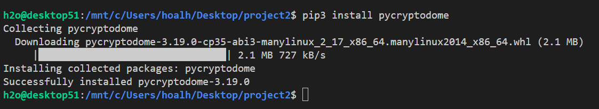
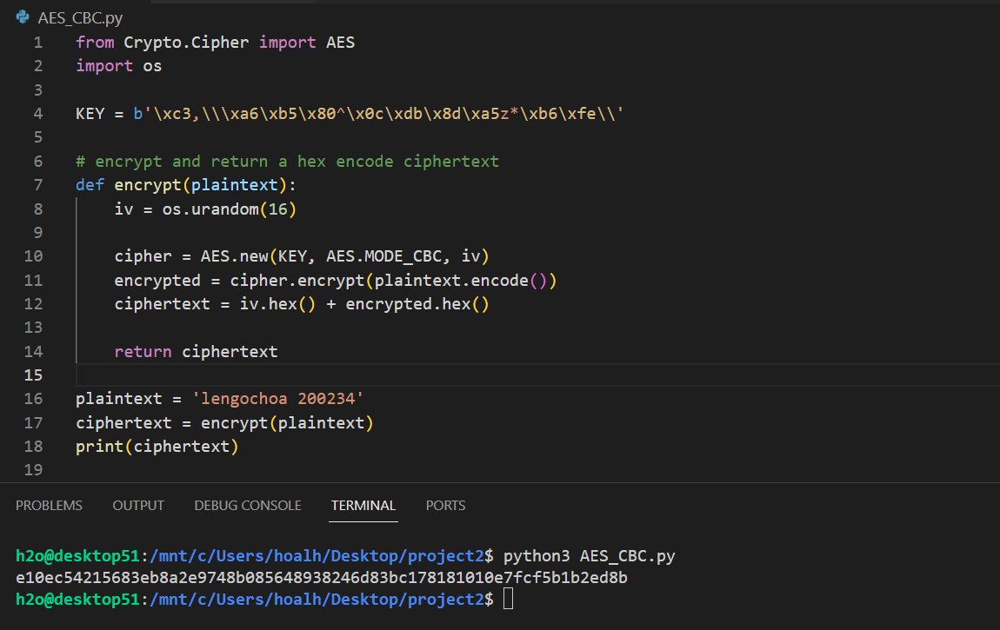
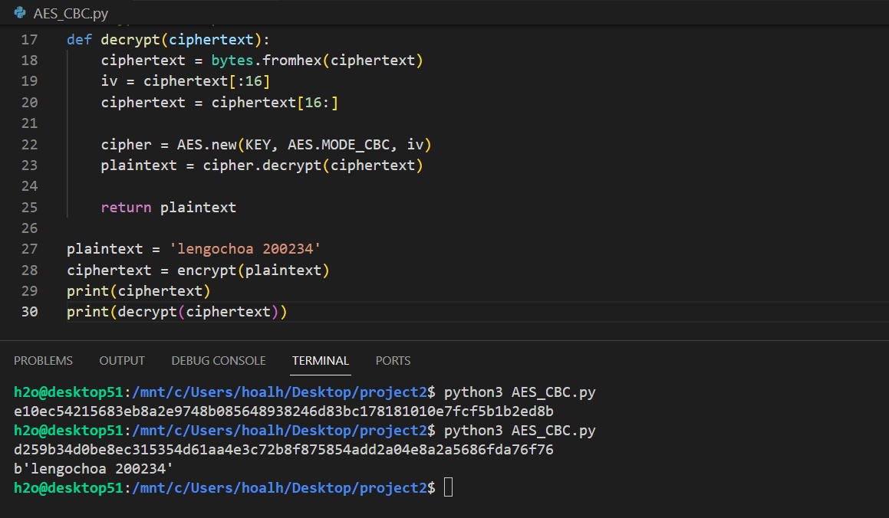
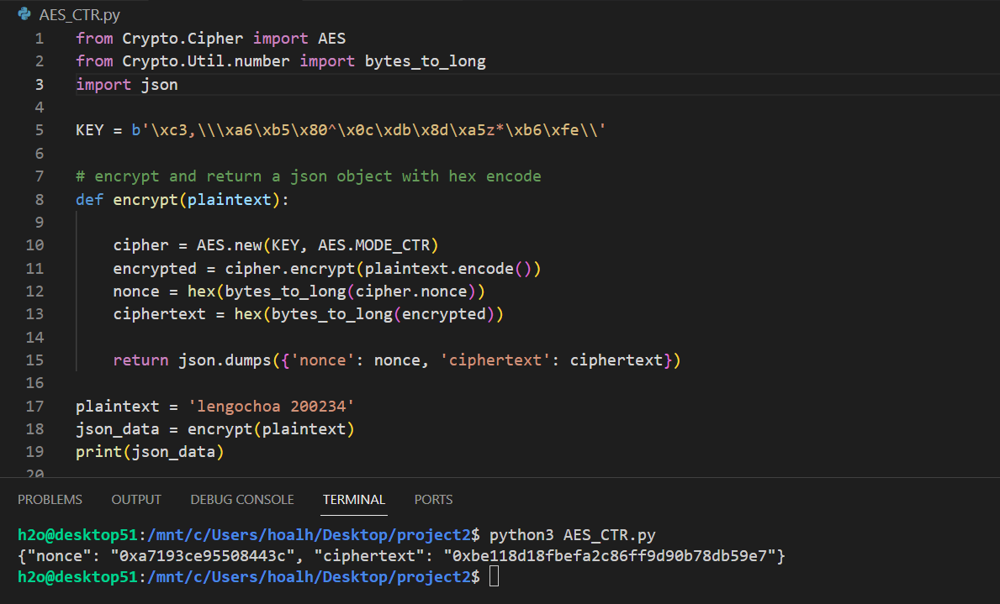
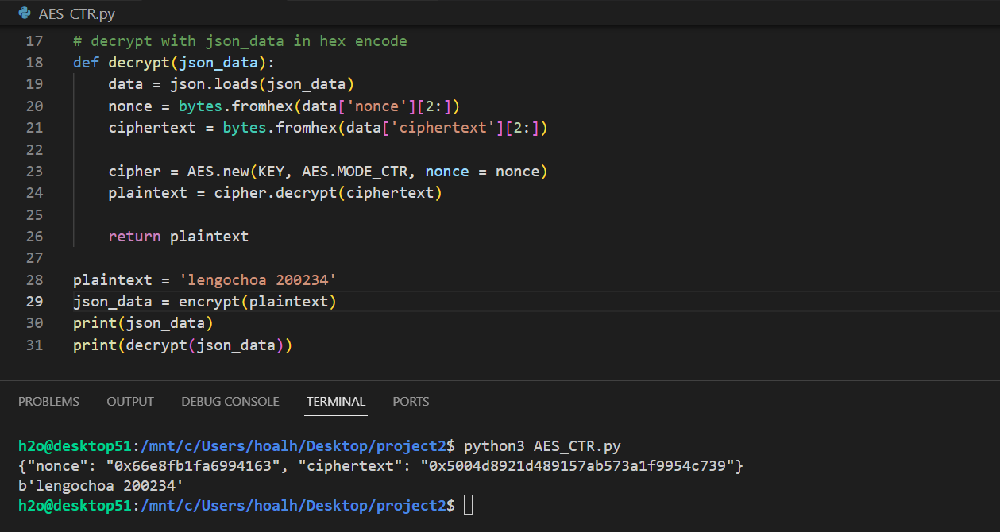
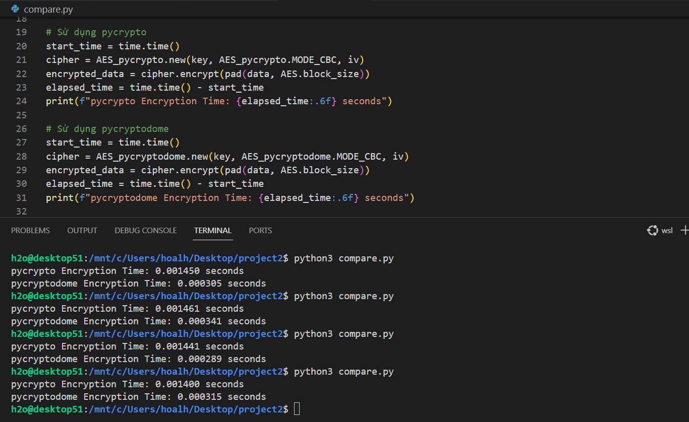

# I. Yêu cầu

Sở đồ mã hóa và giải mã:

- AES với CBC mode: AES_CBC.py
- AES với CTR mode: AES_CTR.py

# II. Mô tả

## 1. Thư viện

Sử dụng thư viện `pycryptodome` với module `Crypto.Cipher`. Cài đặt với Python3:

```
pip3 install pycryptodome
```



## 2. AES với CBC mode

Hàm mã hóa `encrypt()`

```py
def encrypt(plaintext):
    iv = os.urandom(16)

    cipher = AES.new(KEY, AES.MODE_CBC, iv)
    encrypted = cipher.encrypt(plaintext.encode())
    ciphertext = iv.hex() + encrypted.hex()

    return ciphertext
```

- Input là `plaintext` ở dạng string, có độ dài là bội của 16.
- vector khởi tạo `iv` được sinh ngẫu nhiên từ hàm `os.urandom()` với 16 bytes.
- Đối tượng `cipher = AES.new(KEY, AES.MODE_CBC, iv)` thực hiện mã hóa và giải mã, chế độ sử dụng là `AES.MODE_CBC`.
- Mã hóa thực hiện bằng hàm `cipher.encrypt()` với input là plaintext dưới dạng bytes encode.
- Cuối cùng trả về ciphertext dạng hex với iv (dạng hex) ở vị trí tiền tố.



Hàm giải mã `decrypt()`

```py
def decrypt(ciphertext):
    ciphertext = bytes.fromhex(ciphertext)
    iv = ciphertext[:16]
    ciphertext = ciphertext[16:]

    cipher = AES.new(KEY, AES.MODE_CBC, iv)
    plaintext = cipher.decrypt(ciphertext)

    return plaintext
```

- Input là `ciphertext` ở dạng hex encode.
- `ciphertext = bytes.fromhex(ciphertext)` đưa ciphertext về dạng bytes encode.
- vector khởi tạo `iv` lấy từ 16 byte đầu tiên của ciphertext lúc này.
- `ciphertext = ciphertext[16:]` bỏ đi vector khởi tạo ở đầu.
- Đối tượng `cipher = AES.new(KEY, AES.MODE_CBC, iv)` thực hiện mã hóa và giải mã, chế độ sử dụng là `AES.MODE_CBC`.
- Giải mã thực hiện bằng hàm `cipher.decrypt()` với input là ciphertext dưới dạng bytes encode.
- Cuối cùng trả về plaintext dạng bytes encode.



## 3. AES với CTR mode

Hàm mã hóa `encrypt()`

```py
def encrypt(plaintext):

    cipher = AES.new(KEY, AES.MODE_CTR)
    encrypted = cipher.encrypt(plaintext.encode())
    nonce = hex(bytes_to_long(cipher.nonce))
    ciphertext = hex(bytes_to_long(encrypted))

    return json.dumps({'nonce': nonce, 'ciphertext': ciphertext})
```

- Input là `plaintext` ở dạng string, có độ dài là bội của 16.
- Đối tượng `cipher = AES.new(KEY, AES.MODE_CTR)` thực hiện mã hóa và giải mã, chế độ sử dụng là `AES.MODE_CTR`.
- Mã hóa thực hiện bằng hàm `cipher.encrypt()` với input là plaintext dưới dạng bytes encode.
- Biến `nonce = hex(bytes_to_long(cipher.nonce))` và `ciphertext = hex(bytes_to_long(encrypted))` ở dạng hex
- Cuối cùng trả về một đối tượng json với hai key `nonce` và `ciphertext`.



Hàm giải mã `decrypt()`

```py
def decrypt(json_data):
    data = json.loads(json_data)
    nonce = bytes.fromhex(data['nonce'][2:])
    ciphertext = bytes.fromhex(data['ciphertext'][2:])
    
    cipher = AES.new(KEY, AES.MODE_CTR, nonce = nonce)
    plaintext = cipher.decrypt(ciphertext)

    return plaintext
```

- Input là một đối tượng `json_data` có giá trị các `key` ở dạng hex encode.
- Load đối tượng json vào biến `data = json.loads(json_data)`.
- Trích xuất ra các biến `nonce = bytes.fromhex(data['nonce'][2:])` và `ciphertext = bytes.fromhex(data['ciphertext'][2:])` ở dạng bytes encode.
- Đối tượng `cipher = AES.new(KEY, AES.MODE_CTR, nonce = nonce)` thực hiện mã hóa và giải mã, chế độ sử dụng là `AES.MODE_CTR`.
- Giải mã thực hiện bằng hàm `cipher.decrypt()` với input là ciphertext dưới dạng bytes encode.
- Cuối cùng trả về plaintext dạng bytes encode.



# III. So sánh hai thư viện `pycrypto` và `pycryptodome`

Thư viện `pycrypto` đã lỗi thời và chứa nhiều lỗ hổng bảo mật (hiện không được bảo trì), `pycryptodome` được khuyến nghị sử dụng (https://www.pycrypto.org/)

So sánh về hiệu năng, ví dụ thực hiện trong AES CBC mode, sử dụng hai module đối tượng khác nhau của hai thư viện:

```py
# Thư viện pycrypto
from Crypto.Cipher import AES as AES_pycrypto
# Thư viện pycryptodome
from Crypto.Cipher import AES as AES_pycryptodome
```

Với `data` encrypt có độ dài lớn (16 * 10000), thực hiện tính toán khoảng thời gian được sử dụng mã hóa đối với hai thư viện:

- Thư viện `pycrypto`:

```py
start_time = time.time()
cipher = AES_pycrypto.new(key, AES_pycrypto.MODE_CBC, iv)
encrypted_data = cipher.encrypt(pad(data, AES.block_size))
elapsed_time = time.time() - start_time
print(f"pycrypto Encryption Time: {elapsed_time:.6f} seconds")
```

- Thư viện `pycryptodome`:

```py
start_time = time.time()
cipher = AES_pycryptodome.new(key, AES_pycryptodome.MODE_CBC, iv)
encrypted_data = cipher.encrypt(pad(data, AES.block_size))
elapsed_time = time.time() - start_time
print(f"pycryptodome Encryption Time: {elapsed_time:.6f} seconds")
```

Kết quả chương trình `compare.py` cho thấy thư viện `pycryptodome` có tốc độ nhanh gấp khoảng 5 lần so với `pycrypto`

